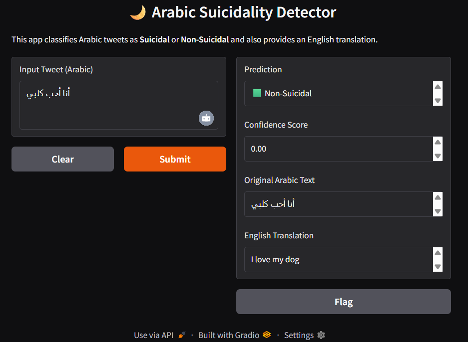
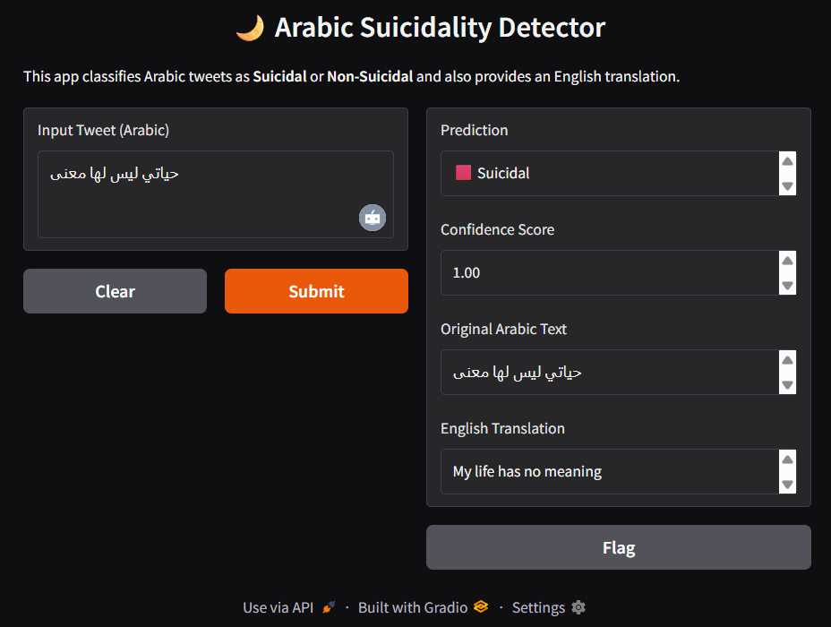

# Arabic Suicidal Tweet Detection

This project identifies whether an Arabic tweet expresses **suicidal intent** or **non-suicidal content**.  
The model was trained using the **AraBERT** language model and deployed through a **Gradio web interface** for easy use.

---

## Dataset

- Source: *Optimized Arabic Suicide Detection Dataset*
- Total Tweets: **2,030**
- Suicidal: **956**
- Non-Suicidal: **1,074**

The dataset contains tweets from different Arabic dialects and has been **expert-labeled** for accuracy.

---

## How It Works

1. The input Arabic tweet is cleaned and normalized.
2. Text is tokenized using the AraBERT tokenizer.
3. The fine-tuned model predicts whether the tweet expresses suicidal ideation.
4. The result is displayed in the Gradio interface.

## Example Outputs

**Non-Suicidal Tweet**


**Suicidal Tweet**


---

## Model File

The trained model is stored externally due to size limits.
---

## Installation

```bash
# Clone the repository
git clone https://github.com/Tintin2310/Arabic-Suicide-Detection.git
cd Arabic-Suicide-Detection

# Install dependencies
pip install -r requirements.txt 
